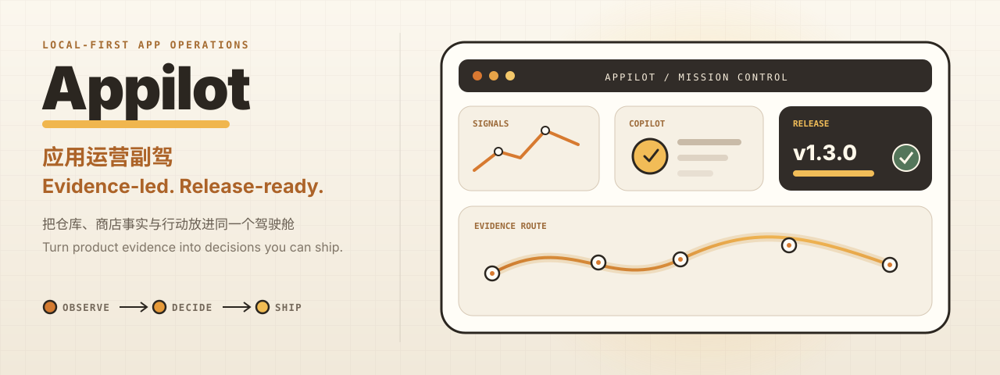

<p align="center"></p>

<p align="center">
  <a href="https://github.com/wxy/appilot/actions/workflows/ci.yml"></a>
  <a href="https://github.com/wxy/appilot/actions/workflows/build.yml"></a>
  
</p>

<p align="center">&nbsp;<a href="https://github.com/wxy/appilot/releases/latest"></a></p>
<p align="center"><code>LOCAL-FIRST · ELECTRON · TYPESCRIPT · SQLITE · NODE 22</code></p>

Appilot is a local-first operations cockpit for independent Apple developers. It connects repository history, App Store facts, ranking evidence, release preparation, and scheduled work without turning them into disconnected dashboards.

> Appilot 是面向独立 Apple 开发者的本地优先应用运营驾驶舱。它把仓库历史、App Store 事实、排名证据、发布准备和调度任务连接起来，而不是把数据拆成互不相关的仪表盘。

<p align="center"></p>

Appilot is built around decisions, not data accumulation. Evidence stays in the feature where it can drive an action; cross-cutting signals reach Overview or Copilot only when they change what you should do next.

> Appilot 围绕“决策”而不是“数据堆积”设计。证据保留在能够直接驱动行动的功能中；只有真正影响下一步判断的跨模块信号，才会进入总览或副驾。

Version 1.2.0 deliberately retires the low-signal Trends and Reviews modules. The milestone concentrates the product on four durable workspaces: Overview, Copilot, Release, and Rankings.

> 1.2.0 主动移除了低信号的趋势和评论模块，把产品集中到四个长期有价值的工作区：总览、副驾、发布与排名。

<p align="center"></p>

| Workspace | What it is for |
|---|---|
| **Overview · 总览** | Current product state, release context, ranking exceptions, and evidence-backed briefings.<br>当前产品状态、发布上下文、排名异常与有证据支撑的简报。 |
| **Copilot · 副驾** | Persistent suggestions with product context, measurable outcomes, follow-ups, and registered actions.<br>保留产品上下文、衡量目标、追问过程与已注册行动的持久建议。 |
| **Release · 发布** | Fresh GitHub release checks, readiness review, localized store copy, screenshot copy, Keynote generation, and PNG export.<br>实时 GitHub 发布检查、就绪度审查、本地化商店文案、截图文案、Keynote 生成与 PNG 导出。 |
| **Rankings · 排名** | Keyword curation, storefront matrices, competitor evidence, history, and deterministic diagnosis.<br>关键词管理、商店矩阵、竞品证据、历史记录与确定性诊断。 |
| **Task Center · 任务中心** | Shared daemon state, execution history, run-now controls, restart, stop, acceleration, and safe schedule balancing.<br>共享守护进程状态、执行历史、立即执行、重启、停止、加速与安全调度平衡。 |
| **Automation shells · 自动化入口** | Desktop, DSH, headless CLI, scheduler, and MCP reuse the same core and SQLite facts.<br>桌面应用、DSH、无头 CLI、调度器与 MCP 复用同一核心和 SQLite 事实。 |

<p align="center"></p>

1. Connect a local repository and select its App Store product.

    > 连接本地仓库，并选择对应的 App Store 产品。

2. Sync only the evidence needed for the current decision: repository, GitHub, App Store Connect, rankings, or local task history.

    > 只同步当前决策需要的证据：仓库、GitHub、App Store Connect、排名或本地任务历史。

3. Let Overview detect issues and let Copilot turn them into contextual, measurable suggestions.

    > 由总览发现问题，再由副驾把问题转化为带上下文、可衡量的建议。

4. Review the proposed action before Appilot changes drafts, schedules, or release materials.

    > 在 Appilot 修改草稿、计划或发布素材之前，先审阅拟执行的行动。

5. Verify the result in the feature that owns the facts, then move the release forward.

    > 回到证据所属功能核对结果，再继续推进发布。

<p align="center"></p>

The desktop UI follows the product workflow instead of mirroring every upstream data source.

> 桌面界面按照产品工作流组织，而不是为每一种上游数据源都建立一个页面。

| Surface | Primary question |
|---|---|
| Overview · 总览 | What needs attention now?<br>现在最需要关注什么？ |
| Copilot · 副驾 | What should I do, why, and how will success be measured?<br>下一步做什么、为什么做、如何衡量成功？ |
| Release · 发布 | Is this version complete, consistent, and ready to ship?<br>这个版本是否完整、一致并可以发布？ |
| Rankings · 排名 | Which keyword/storefront movements deserve action?<br>哪些关键词与商店变化值得采取行动？ |
| Task Center · 任务中心 | Is scheduled work healthy, current, and controllable?<br>调度任务是否健康、及时并且可控？ |

<p align="center"></p>

```text
Electron / DSH / CLI / MCP
            │
            ▼
  @appilot-labs/appilot-core
            │
            ▼
  headless store + scheduler daemon
            │
            ▼
       local SQLite database
```

| Layer | Responsibility |
|---|---|
| `packages/core` | Pure domain logic and external API clients.<br>纯领域逻辑与外部 API 客户端。 |
| `packages/headless` | SQLite store, migrations, task instances, and transport-neutral services.<br>SQLite 存储、迁移、任务实例与传输无关服务。 |
| `packages/scheduler` | Long-running daemon, lease, socket control, self-update, and scheduling.<br>常驻守护进程、租约、控制 socket、自更新与调度。 |
| `src/main` / `src/renderer` | Electron system integration and the React desktop interface.<br>Electron 系统集成与 React 桌面界面。 |
| `plugins/dsh-*` | Appilot, project, and release tools/cards for DeepSeek Harness.<br>面向 DeepSeek Harness 的 Appilot、项目与发布工具/结果卡片。 |
| `packages/headless-cli` / `packages/mcp` | Scriptable CLI and MCP stdio entry points.<br>可脚本化 CLI 与 MCP stdio 入口。 |

Nine public `@appilot-labs/*` packages are versioned together and published through npm Trusted Publishing with provenance. The Electron root and local launcher are not npm distributions.

> 9 个公开的 `@appilot-labs/*` 包统一版本，并通过 npm Trusted Publishing 携带 provenance 发布。Electron 根应用和本地启动器不作为 npm 包发布。

See [architecture convergence](docs/architecture-convergence.md), [headless architecture](docs/headless-architecture.md), and [scheduler daemon architecture](docs/architecture-scheduler-daemon.md) for detailed boundaries.

> 详细边界参见[架构收敛](docs/architecture-convergence.md)、[无头架构](docs/headless-architecture.md)与[调度守护进程架构](docs/architecture-scheduler-daemon.md)。

<p align="center"></p>

Requirements: Node.js 22, npm, and macOS for the full Electron and Keynote workflow. Core packages, CLI, scheduler, and MCP remain cross-platform where their integrations allow it.

> 环境要求：Node.js 22、npm；完整 Electron 与 Keynote 工作流需要 macOS。核心包、CLI、调度器与 MCP 在集成条件允许时保持跨平台。

```bash
git clone https://github.com/wxy/appilot.git
cd appilot
npm ci
npm run dev
```

Run the release gates before opening a pull request:

> 提交拉取请求前请运行发布门禁：

```bash
npm run typecheck
npm test
npm run build
```

Build a local macOS package with:

> 本地构建 macOS 安装包：

```bash
npm run dist:mac
```

Publishing maintainers should follow [the npm and profile publishing SOP](docs/publishing.md). Signed and notarized macOS builds follow [the release checklist](docs/RELEASE.md).

> 发布维护者请遵循 [npm 与 profile 发布 SOP](docs/publishing.md)；签名并公证的 macOS 构建遵循[发布清单](docs/RELEASE.md)。

<p align="center"></p>

- By default, operational data stays in `~/Library/Application Support/Appilot/appilot.db`.

    > 默认情况下，运营数据保存在 `~/Library/Application Support/Appilot/appilot.db`。

- GitHub, AI, and App Store Connect credentials use Electron `safeStorage`; macOS stores the encryption key through Keychain and Windows uses DPAPI.

    > GitHub、AI 与 App Store Connect 凭据使用 Electron `safeStorage`；macOS 通过钥匙串保存加密密钥，Windows 使用 DPAPI。

- App Store Connect private keys live in the application data directory and must never be committed.

    > App Store Connect 私钥保存在应用数据目录，绝不能提交到仓库。

- Remote writes require an explicit action. Read-only collection and diagnosis stay separate from mutation.

    > 远程写入必须由明确行动触发；只读采集与诊断和修改操作保持分离。

<p align="center"></p>

**Contributing · 参与贡献**

Keep changes scoped, preserve existing data, and include current test or build evidence. Discuss substantial product changes before implementation.

> 请控制改动范围、保留现有数据，并附上当前测试或构建证据。重大产品变更应先讨论再实施。

**License · 许可证**

No open-source license is currently published. Source visibility does not grant permission to reuse or redistribute the code.

> 当前未发布开源许可证。源码可见并不代表获得复用或再分发许可。

**Links · 链接**

- [Releases](https://github.com/wxy/appilot/releases/latest) · [Issues](https://github.com/wxy/appilot/issues) · [Product backlog](docs/product-backlog.md) · [Documentation](docs/README.md)

    > [发布版本](https://github.com/wxy/appilot/releases/latest) · [问题](https://github.com/wxy/appilot/issues) · [产品待办](docs/product-backlog.md) · [文档](docs/README.md)
